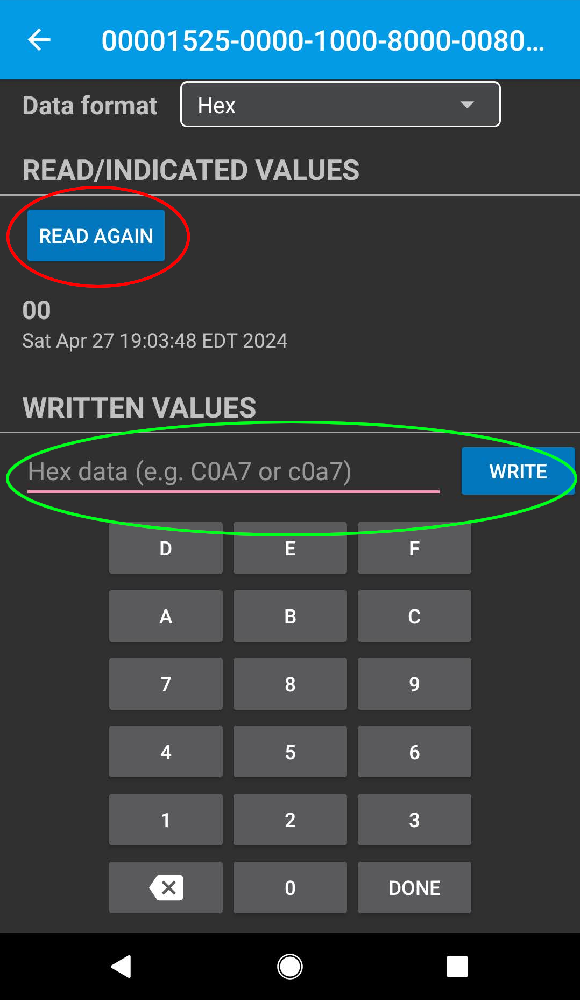

.. _Bluetooth:

Bluetooth
=========
Using Bluetooth Low Energy (BLE) to communicate with the NanoNav.

Quick Example
-------------

.. code-block:: python

    from nanonav import BLE
    import time

    # Create a Bluetooth object
    ble = BLE(name="NanoNav")  

    ble.send(43)
    response = ble.read()
    # wait until something changes, indicating a response
    while response == 43:
        response = ble.read()
	time.sleep(0.5)

    print("Received: ", response)

Usage
-----

.. autoclass:: nanonav.BLE     
    :members: 

.. note::
  Just as a heads up, we've noticed that occasionally the value stored on the BLE characteristic gets corrupted. Wherever you call the `read` method, it's a good idea to verify that 
  the value is within the range you expect (and not ``None``), and if not, consider requesting the value again.   

Connecting from Mobile
----------------------

Various mobile apps are available for communicating with Bluetooth Low Energy. We recommend LightBlue which is available for both iOS and Android.
After downloading and installing it, you will need to turn your phone's Bluetooth on and open the app (no pairing is needed for Bluetooth Low Energy).

If the NanoNav is waiting for a BLE connection, you will see it as one of the connection options in LightBlue. You may need to scroll down to find it.

.. note::
    On some versions of iOS, the BLE devices are automatically renamed, and NanoNav's connection may show up as "Arduino" or something else. If you find yourself in this 
    situation, it can be helpful to search for the Arduino's MAC address instead, which means identifying the device once in LightBlue and keeping track of its MAC address for future connections.

.. image:: images/lightblue_devices_view.png
  :width: 400
  :alt: LightBlue Application with Bluetooth connections available

After clicking the connect button, you will see a screen like this, which gives information about the connection.

.. image:: images/lightblue_connected_view.png
  :width: 400
  :alt: LightBlue Application after connecting to device

It is possible to configure the BLE for more complex behavior, but with this kit we only need to send small numbers back and forth with the Arduino. Click on the 
option at the bottom (highlighted in red in the above screenshot) to open the portal where you can perform this simplified communication with NanoNav. 

You can think of a BLE connection as a secret whiteboard that you and your friend share. There is always some number written on it, and each of you 
can look at (read) whatever is on it whenever you like, and can also change (write to) it whenever you like. Inside the LightBlue app, as shown in the 
above picture, you can click the :blue:`Read Again` button as often as you would like, but the value will only
change when you (or NanoNav) writes to it. And you can send a number as often as you want in LightBlue, but NanoNav will not know unless you program it to 
read the value periodically. (Actually, you can setup BLE interrupts for NanoNav to run code when something changes in the BLE connection, similar to the :py:meth:`~nanonav.BLE.on_connected` and :py:meth:`~nanonav.BLE.on_disconnected`, but we think 
you'll have an easier time getting your code to work as expected by avoiding that kind of programming for now).
If interested in learning about other bluetooth capabilities beyond the scope of NanoNav, see `here <https://docs.micropython.org/en/latest/library/bluetooth.html>`_.
